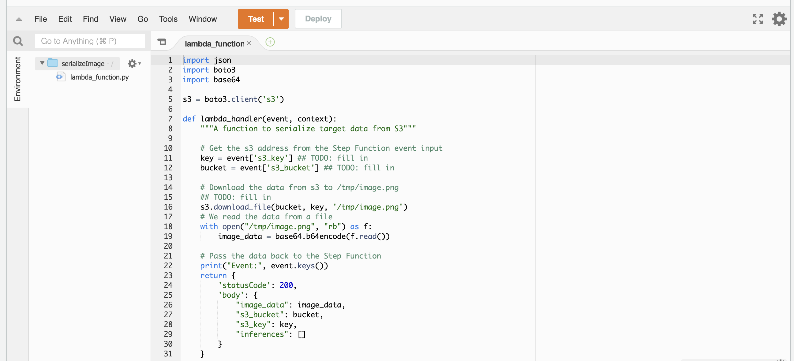
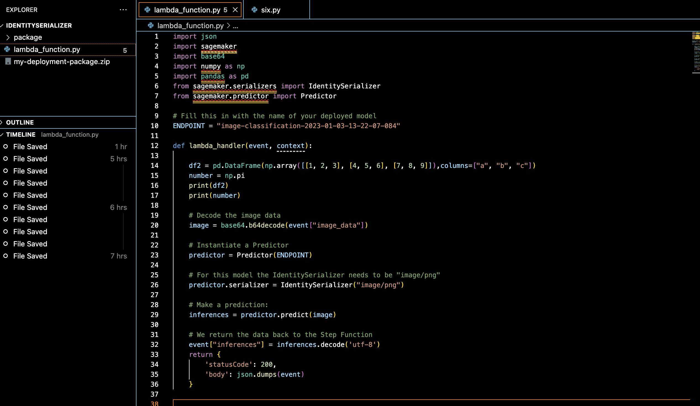
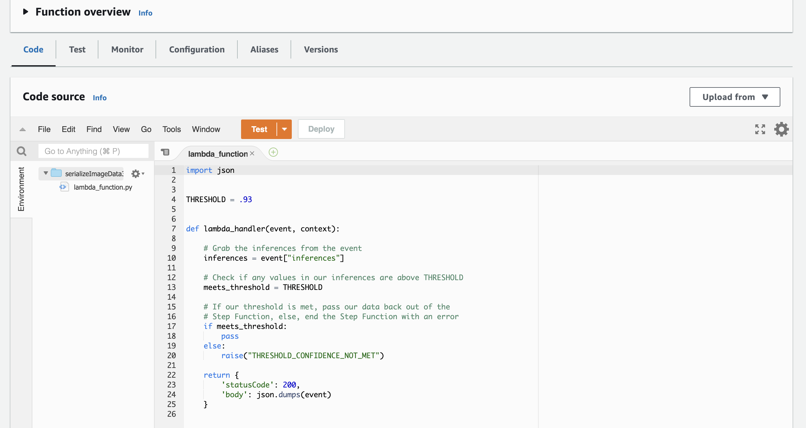
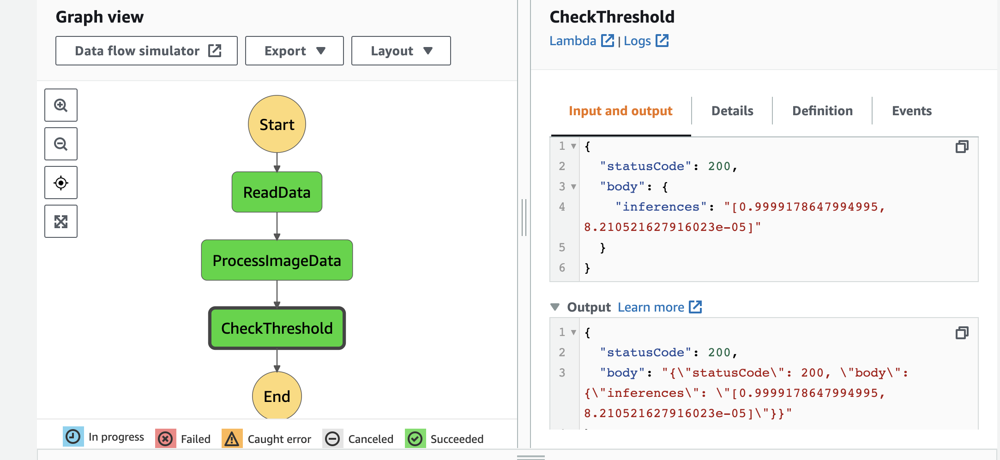

# Module 2 - Deploying Your First ML Workflow

## Scones Unlimited

Scones Unlimited requires an image classification model to keep track of their delivery vehicles, which consist of motorcycles and bicycles.

## CIFAR Dataset

The data was extracted from CIFAR and were split into 3 datasets: dataset_meta, dataset_train, and dataset_test. The dataset keys consisted of the filenames, batch_label, fine_labels, course_labels, and image data.

The image data contains rows of 3073 unsigned integers, representing three channels (red, green, and blue) for one 32 x 32 pixel per row. The images used for the training were later on created by stacking these channels into a 32 x 32  x 3 array.

This was done after extracting bicycle and motorcycle images from our training data and test data by filtering them using the labels 8 and 48. After extracting and transforming the image data, the files were uploaded to the S3 bucket in preparation for model training.

## The Image Classifier Model

The Image Classifier Model was defined by adding the location of the data, the execution role, the instance count, the instance type, the output path and the session using the estimator idiom.

```python

img_classifier_model=sagemaker.estimator.Estimator(   
    algo_image,
    role = role,
    instance_count = 1,
    instance_type = 'ml.p3.2xlarge',
    output_path = s3_output_location,
    session = sagemaker.Session()
)

```

Additional hyperparameters, which include the image shape, number of classes and number of training samples were also specified to create the model. The four input channels used to train the model were also specified: train, validation, train_lst, and validation_lst. The latter contained the metadata that were generated for the purpose of running Sagemaker.

## Deployment

Deployment involved configuring the data capture monitor where the model performance will be recorded for later use. This configuration was added to the deployment function where an instance type of ml.m5.large and an instance count of 1 was specified.

Upon deployment, an endpoint was created to generate predictions. This would later on be used for the Lambda Functions and Step Functions.

## Lambda Functions

The first lambda function retrieves the data from the S3 bucket and encodes the image data that will later on be used by the second function to make an inference of an image. 

As the second function required the sagemaker package with dependencies, it had to be created locally. The package and Lambda Function were then zipped and uploaded into an S3 bucket.





The third lambda function defines the threshold of the prediction and raises an error if the threshold is not met.



As each function was created, they were tested using a dictionary of input values taken from the test folder.


## Step Functions

The 3 Lambda functions were chained so that the ouput of each step would be used by the next step.



A json definition of the state machine can also be found [here](MyStateMachine.asl.json)

## Test Evaluation

After ensuring that the state machine ran successfully, random samples from the test dataset were used to generate predictions.

Data from the model monitor were then retrieved and used to create a plot to show the model's performance.

## Reflection

The model seemed to perform very well as the plot showed that it was always within threshold. It was very easy to assume that the reason for this was insufficient data. However, in the process of putting this report together, it can be seen that there was an error in line 10 of my third lambda function which may have been responsible for the model's perfect performance.